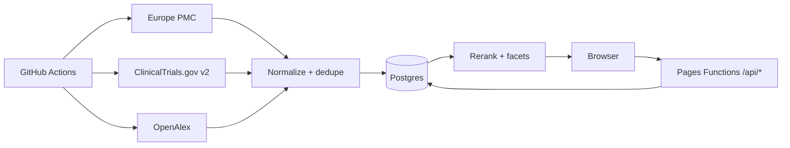

# bioXip — Blueprint

Dokumen hidup. Setiap perubahan arsitektur wajib dicatat di sini.

## 1. Vision & positioning

- Target: peneliti, mahasiswa FK/kesmas/farmasi, klinisi, nakes Indonesia.
- Masalah: literatur biomedis global (~30 jt) tersembunyi di balik bahasa Inggris dan paywall; Garuda/OneSearch/Neliti hanya mengindex konten Indonesia.
- Solusi: search engine literatur internasional yang bisa dicari dengan Bahasa Indonesia, menampilkan status open-access, dan menautkan ke versi lokal Indonesia.
- Gap yang diisi: Garuda (konten Indonesia), OneSearch (katalog perpustakaan), Neliti (platform hosting konten lokal) — tidak ada yang membawa literatur dunia ke peneliti Indonesia.
- **Prinsip produk mengikat ada di `docs/principles.md`**: pasar Indonesia, mobile-first (95%), sign in Google + Apple + magic link, share-first (WhatsApp/Instagram/Threads/X), halaman share publik, pembayaran lokal, tanpa PII.

## 2. Brand

- Nama: bioXip. Ejaan konsisten `bioXip` (bukan BioZip).
- Tagline ID: "Literatur medis dunia, untuk peneliti Indonesia."
- Tagline EN: "The world's medical literature, for Indonesian researchers."
- Nama hanya di `web/js/brand.js`.

## 3. Sumber data & keputusan lisensi

| Provider | Peran | Akses |
|---|---|---|
| Europe PMC | Korpus: paper + preprint (PubMed, bioRxiv, medRxiv, PMC full-text), citasi | Bebas, delta harian |
| ClinicalTrials.gov v2 | Korpus: trial (core dulu; results fase 2) | Bebas, delta harian |
| OpenAlex | Enrichment: OA location + citation + konsep per DOI | Bebas (CC0), mingguan |
| ChEMBL / PubChem / Open Targets | Live lookup query-time + cache 24 jam (fase 3) | Bebas |
| Neliti (OAI-PMH) | Lapisan lokal: metadata konten unik Indonesia, link ke full-text | Bebas (set=unique) |

Keputusan: JANGAN bergantung pada API berbayar/tutup (Valyu pernah dipakai di proyek lama — ditinggalkan karena index tertutup, biaya per-query, dan key bocor di riwayat git). Hanya metadata+abstrak yang disimpan; full-text OA dapat diindeks sesuai lisensi artikel; tautkan, jangan re-host.

## 4. Arsitektur

- Statis-first di Cloudflare Pages CDN; edge logic di Pages Functions; Postgres terkelola di Supabase; pipeline Python hanya berjalan offline di GitHub Actions.
- 3 jalur data: (a) korpus di-harvest ke `documents`, (b) enrichment offline, (c) live lookup yang di-cache.
- Query-time = 1 pencarian di index sendiri (Postgres FTS) + <3 panggilan live.

## 5. Skema database

File `supabase/migrations/001_documents.sql` sd `004_ops.sql`.
Inti: tabel `documents` (doc_type, identity_key unik, work_group utk dedupe preprint↔published, search_vector gin) + `term_map` (jembatan query ID→EN) + tabel ops (`harvest_runs`, `provider_cursor`, `live_cache`, `search_cache`, `search_logs`, `usage_quota`). RLS: publik read aktif; tulis hanya service_role.

## 6. Harvester & ops

- `harvest_full.py` backfill bertahap per tahun; `harvest_delta.py` harian per watermark.
- Dedupe: identity_key = doi/pmid/nct; preprint & published digabung ke `work_group`.
- Observability: `harvest_runs` mencatat counts/status/log; alert bila gagal 2x berturut.

## 7. Search API & ranking

`GET /api/search` → `fn_bioxip_search`. Query ID diekspansi lewat `term_map`.
Score = 0.36 text + 0.20 recency + 0.16 kualitas sumber + 0.12 coverage + 0.10 authority + 0.06 OA.
Satu hasil per work_group (published menang). Facet: type/source/tahun/OA/desain studi/"penelitian Indonesia".

## 8. Frontend

SPA vanilla hash-route: `#/`, `#/search`, drawer detail, `#/topic/{slug}`, `#/sources`, legal. ID default.

## 9. Keamanan & kepatuhan

Secrets: SUPABASE_URL, SUPABASE_ANON_KEY (edge), SUPABASE_SERVICE_ROLE (CI only), Turnstile. Kuota anon di `_middleware`. Turnstile **belum aktif** — hanya ada `TURNSTILE_SECRET_KEY` opsional di env; widget + verifikasi `siteverify` adalah backlog prarilis (lihat `docs/plan.md`). Header `X-Turnstile-Required` yang dulu dipasang tanpa verifikasi **dihapus** 2026-09-11 karena menyesatkan. Atribusi sumber + halaman kebijakan wajib. Tidak ada key di frontend.

## 10. Monetisasi

Search dasar gratis permanen. Jalur: (1) langganan institusi FK/perguruan tinggi, (2) API-as-product, (3) premium perorangan murah (terjemahan, alert, export), (4) laporan B2G, (5) sponsor/donasi. Iklan tidak direkomendasikan.

## 11. Roadmap

- F1 Fondasi: repo + migrations + harvester Europe PMC + fn search + landing search. Exit: search <800 ms; run harian tercatat.
- F2 Trial & lokal: CT.gov core + facet + filter "penelitian Indonesia" + term_map 10 topik + tombol "Cek versi lokal".
- F3 Enrichment & kimia: OpenAlex OA/citasi + live ChEMBL/PubChem/OT.
- F4 Produk masal: Turnstile, kuota, legal, admin, observability.
- F5 Monetisasi & lapisan lokal (Neliti OAI-PMH set=unique).

## 12. Decision log

- 2026-09-09 — Nama dipilih: bioXip.
- 2026-09-09 — Pasar: lokal Indonesia dulu (bilingual), data internasional.
- 2026-09-09 — Tidak memakai Valyu sebagai sumber inti (index tertutup, biaya, key bocor). Sumber = API publik yang bisa direplikasi mandiri.
- 2026-09-09 — Korpus literatur via Europe PMC tunggal (cakup PubMed+bioRxiv+medRxiv+PMC); trial via CT.gov v2; enrichment OpenAlex.
- 2026-09-09 — Neliti layak di-harvest via OAI-PMH `set=unique` (lapisan lokal) — keputusan ditunda ke fase 5.
- 2026-09-09 — Stack: Cloudflare Pages + Functions + Supabase Postgres + Python (GitHub Actions). Streamlit tidak dipakai (khusus MVP lokal).
- 2026-09-09 — Repo dibuat baru `D:\bioxip` (bukan clone eclipta: riwayat lama membawa key bocor & venv Windows).
- 2026-09-09 — Supabase: BUAT PROYEK BARU `bioxip` (region Singapore). Proyek lama `eclipta.bio` (paused) TIDAK dipakai/dilanjutkan — hanya arsip; jangan dihapus sebelum dipastikan tidak dipakai produk lain.
- 2026-09-09 — Arah (belum implementasi): harvester Neliti OAI-PMH `set=unique` → simpan metadata sendiri → hasil menautkan balik ke Neliti (fase 5).
- 2026-09-09 — Monetisasi: akses data tetap free; iklan dipertimbangkan ala Neliti dengan pagar: tanpa iklan obat/klaim kesehatan, direct-sales, transparan.
- 2026-09-09 — Opsi penyimpanan: index **metadata-only** (gaya Google Scholar). `STORE_ABSTRACTS=false`; abstrak tidak disimpan permanen; user dibuka ke sumber asli. Hasil: 20.226 dokumen = ±37 MB (kapasitas free ±270 rb dokumen). Abstrak saat detail bisa diambil live + cache pendek (fitur lanjutan).
- 2026-09-09 — Runtime: Cloudflare Pages `bioxip.pages.dev` live; Supabase project `nxlcosnksgbuvtiggjpw`; backfill manual bertahap 10k/batch (2025 & 2024 terpasang). GitHub secrets masih menunggu konfirmasi email GitHub.
- 2026-09-10 — Arah USP: "dari keputusan klinis sampai keamanan obat"; dua suite (Klinis + Farmasi), satu mesin. Strategi & validasi berlapis ada di `docs/strategy.md`. Urutan: S1 Drug Card → S2 Interaction/Monitoring → S3 Jembatan klinis↔farmasi → S4 Lapisan lokal → S5 API/intelijen.
- 2026-09-10 — CI: workflow **Validate** (katalog obat, monitoring, tabel interaksi, harness UI, cek sintaks JS) dijalankan tiap push/PR. Workflow **Validate API** harian 22:00 UTC menguji kontrak produksi. Workflow `deploy.yml` **dihapus** — deploy dilakukan otomatis oleh integrasi Git Cloudflare Pages (tanpa perlu secret Cloudflare di GitHub).
- 2026-09-10 — Validasi kontrak API: 22 cek hijau di produksi (search, answer + integritas sitasi, drug card termasuk agregasi label & monitoring, interaction checker, penolakan input tak valid).
- 2026-09-10 — Model bisnis AI: prepaid kredit (bayar → saldo → pakai AI → margin). Rancangan teknis (skema ledger, alur debit/refund, kontrak endpoint, guardrail) ada di `docs/credits.md`. Prinsip: ledger append-only + idempotent top-up + grounded-only (wajib retrieval & sitasi) + tanpa data pasien.
- 2026-09-10 — Keputusan monetisasi (lihat `docs/credits.md`): top-up via **Xendit**; **DeepSeek V4.1 Flash** sebagai provider AI tunggal (dengan abstraksi provider); **percakapan disimpan untuk evaluasi** (retensi 90 hari, boleh dihapus, tanpa data pasien); pembeda gratis vs berbayar = **mode eksplisit** (segmented: `Cari bukti · gratis` vs `Tanya AI · saldo`), search-first, estimasi Rp tampil sebelum eksekusi; endpoint search/data tidak pernah menyentuh ledger.
- 2026-09-10 — Model akses FINAL: **tanpa trial**. **Sign in wajib sejak versi gratis** (search & data gratis untuk pengguna login); **AI terkunci bila saldo Rp0**. Saldo dibeli bertingkat (Rp50rb/100rb/150rb/500rb), dalam **Rp**, **tanpa kedaluwarsa**, **tanpa bonus**, markup **12×** biaya asli DeepSeek V4.1 Flash (cache hit $0,006 / miss $0,30 / output $1,20 per 1 juta token). Top-up Xendit (QRIS + VA + e-wallet). Optimasi **prompt cache** (prefix stabil) jadi pengungkit margin utama.
- 2026-09-10 — Arsitektur basis pengetahuan AI (anti-halusinasi) ada di `docs/knowledge.md`: grounded-only + abstain + verifikasi sitasi, retrieval paralel, section-aware chunking, reranker, lapisan fakta terstruktur, golden set per domain, regresi CI. **PubMed masuk dua jalur**: via Europe PMC (`SRC:MED`, sudah terpasang) + **NCBI E-utilities langsung** (MeSH presisi, Clinical Queries, cross-check kelengkapan).
- 2026-09-10 — Rencana implementasi bertahap ada di `docs/plan.md`: Sprint 1 **Auth (Google OAuth + magic link) + gating + SEO publik** → Sprint 2 PubMed E-utilities → Sprint 3 Ledger → Sprint 4 Grounded internal + golden 30 → Sprint 5 AI proxy + debit DeepSeek → Sprint 6 UI gratis vs AI → Sprint 7 Xendit → Sprint 8 kualitas retrieval & data. Review apoteker/dokter dan lapisan lokal berjalan paralel.
- 2026-09-10 — Keputusan akses: **sign in wajib sejak versi gratis** (untuk data pengguna), metode **Google OAuth + magic link email**. Konten di balik login dikompensasi dengan halaman publik untuk SEO (`/topik/*`, drug card ringkas, `/sumber`, `/harga`, `/legal`) + **preview 3 hasil**. Onboarding mengumpulkan peran/institusi/kebutuhan + consent (UU PDP).
- 2026-09-10 — Rancangan onboarding & segmentasi ada di `docs/onboarding.md`: 3 kartu (peran dua tingkat dengan **Apoteker/Farmasi** sebagai segmen utama → institusi opsional → tujuan + consent), lalu **3 template pertanyaan AI per peran** ala Consensus (contoh hasil mock bertanda "contoh" bila saldo Rp0). Termasuk tabel `profiles`, event analitik, funnel, dan aturan pemakaian data (agregat n≥10, tanpa PII di analitik, hak hapus).
- 2026-09-10 — **Prinsip produk mengikat**: `docs/principles.md`. Pasar Indonesia; **mobile-first** (95%+, PWA, target 360px, LCP <2,5 dtk); **sign in Google OAuth + magic link/OTP** (Apple Sign In dibatalkan); in-app browser & keterkiriman email wajib ditangani; **fondasi berbagi sekarang** (halaman publik + OG tags + salin tautan), **integrasi kanal share ditunda ke backlog**; loop rujukan `?ref=` + K-factor juga di backlog; pembayaran lokal; checklist rilis mobile wajib lulus.
- 2026-09-10 — Pembatalan **Apple Sign In** (hemat biaya Apple Developer Program, hindari kerumitan Service ID/key & masalah "Hide My Email"); email sama via Google & magic link harus di-*link* agar tidak jadi akun ganda; tambah **OTP 6 digit** sebagai cadangan magic link.
- 2026-09-10 — **Sprint 2 selesai**: PubMed E-utilities (`functions/_pubmed.js`: esearch/esummary, filter Clinical Queries, throttle 150ms, `tool=bioxip`+email+opsi API key) terintegrasi ke `/api/search` sebagai fan-out ketiga; dedupe DOI/PMID dengan prioritas Europe PMC > PubMed > ClinicalTrials.gov; PubMed tidak dihitung ke `total` (karena Europe PMC sudah mencakup MEDLINE) untuk mencegah hitungan dobel; badge sumber di UI. Validasi produksi: sumber `pubmed` + `europepmc` muncul, 0 duplikat pada 4 query uji. Sprint 1 dipisah menjadi **1A (fondasi publik/SEO + salin tautan, tanpa kredensial)** dan **1B (auth+gating, menunggu Google OAuth client + SMTP)**.
- 2026-09-10 — **Sprint 1A selesai**: 11 halaman statis publik (`/topik/` + 10 topik Indonesia) dari satu sumber `web/data/topics.json`, lengkap dengan OG tags + 11 gambar 1200×630, JSON-LD (MedicalWebPage/BreadcrumbList), canonical, sitemap 12 URL, robots dengan Sitemap, cache `/topik/*` & `/og/*`. Tombol **Salin tautan** di hasil pencarian, drug card, dan halaman topik. Validasi: `validate_topics.js`, `build_topics.js --check`, `ui_harness`, `validate_api` — semua hijau. Ini melindungi trafik organik sebelum gating auth (Sprint 1B) dinyalakan.
- 2026-09-10 — **Sprint 3 (Ledger) selesai**: migrasi 008+009 (append-only ledger + operasi hold/settle/refund + RLS + view rekonsiliasi), RPC `fn_credit_*` (grant hanya service_role), endpoint `/api/credits/me` & `/ledger` (401 tanpa JWT di produksi), harga µIDR markup 12×. Dua bug penting diperbaiki: (1) `INSERT ... ON CONFLICT` memvalidasi CHECK baris kandidat sehingga upsert delta negatif selalu gagal → trigger memakai `UPDATE` + `row_count`; (2) **path impor relatif salah** membuat bundel Functions gagal sehingga deploy tertahan (rute baru menyamar sebagai 200 index.html) → diperbaiki dan ditambah `scripts/validate_imports.js` + halaman `404.html` agar rute tak dikenal tidak lagi menyamar sukses. Validasi live hold→settle→refund: **12/12 PASS**.
- 2026-09-10 — **Sprint 4 (Grounded pipeline) selesai**: `_safety.js` (blokir data pasien/diagnosis/peresepan + deteksi red flag), `_grounded.js` (retrieval → prompt grounded statis cache-friendly → skema JSON claims/citations/abstain → verifikasi sitasi + `support_rate` → fallback ekstraktif tanpa provider), `_provider.js` (DeepSeek JSON mode + pembacaan token cache), endpoint `api/dev/answer` bergerbang `DEV_ADMIN_TOKEN` (**404 bila tidak diset**; terverifikasi produksi). Golden set **40 item** (25 berjawab, 5 abstain, 5 tidak aman, 5 red flag) + `scripts/validate_grounded.js` (struktur selalu; uji live bila token tersedia).
- 2026-09-10 — **Sprint 5 (AI proxy + debit) selesai, mode mock**: `POST /api/ai/chat` SSE dengan alur hold → stream → settle/refund (tagihan dijamin ≤ hold), guardrail 422, 402 tanpa saldo, 401 tanpa JWT; `GET /api/ai/estimate`; migrasi `010_ai_logging.sql` (`fn_ai_log_usage`/`fn_ai_log_chat` SECURITY DEFINER) sehingga edge dapat mencatat log tanpa service_role. **Mock ekstraktif aktif otomatis bila `DEEPSEEK_API_KEY` belum diset** (tetap memotong saldo, minimum Rp100) → aman untuk demo/uji tanpa biaya token. Validasi live end-to-end: 402 → grant Rp50.000 → 422 → estimasi Rp267 → SSE lengkap → tagihan Rp100 → saldo 49.900 → log margin tercatat (**ALL PASS**). Review lanjutan menambahkan **rate limit 429 per-user** (`usage_limits`/env), **margin keamanan estimasi 1,3×** saat provider aktif, verifikasi status log, dan pemisahan `_estimate.js`.
- 2026-09-10 — **Sprint 6 (UI mode gratis vs AI) selesai**: segmented `Cari bukti · gratis` ↔ `Tanya AI · saldo`, estimasi Rp di tombol, badge saldo header (4 status), AI terkunci tanpa akun/saldo, halaman `#/saldo` (kartu + riwayat 25 transaksi), halaman `#/harga` (paket + rumus biaya). Bottom nav: Cari · Jawaban · Obat · Saldo · Sumber. Temuan review: service worker belum mem-precache modul baru → diperbaiki (SW **v4**) + `validate_imports` kini memeriksa **parity precache SW vs modul JS**.
- 2026-09-10 — **Review Sprint 6 (perbaikan)**: (1) submit form dari mode AI sebelumnya **menghilangkan `mode` dan filter** (tipe/sort/per_page) → kini dipertahankan; (2) badge saldo di-*throttle* 10 dtk dan di-refresh tiap perubahan rute; (3) bila saldo gagal dimuat (non-401) panel AI menampilkan pesan jelas alih-alih mengaktifkan tombol; (4) harness kini **benar-benar memicu handler submit** (stub elemen menyimpan listener) sehingga bug semacam ini tertangkap otomatis.
- 2026-09-10 — **Sprint 7 (top-up Xendit, mode mock) selesai**: migrasi 011 + 012 (`channel/external_id/payment_url/expires_at/raw`; RPC create/get/attach + `fn_topup_mark_paid` idempotent khusus service_role), edge `POST/GET /api/credits/topup` + `POST /api/payments/webhook` (verifikasi `x-callback-token`), `_xendit.js` (mock otomatis tanpa kunci; live memakai Xendit Payment Requests), UI isi saldo dengan polling status. Dua bug ditemukan & diperbaiki: OUT parameter `status` **bentrok dengan kolom `topups.status`** (ambiguous) dan `create or replace` tak bisa mengubah return type → `drop function` + `topup_status` + kualifikasi kolom + `notify pgrst reload schema`. Validasi live **ALL PASS 12/12** termasuk webhook dobel tidak menggandakan saldo.
- 2026-09-10 — **Sprint 8 (kualitas retrieval, adaptasi Live murni) selesai**: `_terminology.js` (ekspansi ID→EN+MeSH ±50 konsep, klasifikasi jenis pertanyaan, Clinical Queries EPMC/PubMed, klausa **AND antar-konsep**), `_rank.js` (reranker heuristik + guard "jangan reorder bila skor nol" + `sectionSnippet` Results/Conclusion), `search.js` (abstrak untuk skoring lalu disembunyikan bila tak diminta; judul dibersihkan — decode entitas sebelum strip tag; ekspansi nama obat Indonesia; pelonggaran bertahap; `clinical=1`), `_grounded.js` (bukti memakai `sectionSnippet` + clinical). Golden set **205 item** (40 kurasi + 165 draft berlabel) + `build_golden --check`. Unit test baru: `rank_unit`, `drugs_unit`, `functions_smoke` (eksekusi `onRequestGet` dengan fetch tiruan → menangkap ReferenceError yang lolos dari `node --check`). Bug diperbaiki: abstrak tak sampai ke grounded, judul bocor HTML, ekspansi OR terlalu lebar, dan `drugTerm/drugTerms` yang menyebabkan **500**. Catatan: keputusan **tanpa index lokal** dipertahankan — kualitas ditingkatkan di lapisan live, bukan dengan membangun korpus.
- 2026-09-11 - **Sprint 9 (cache edge & throttle)**: throttle NCBI diperbaiki ke 350 ms tanpa key / 100 ms dengan key (sebelumnya 150 ms melanggar batas 3 rps). Edge cache /api/search via Cloudflare Cache API (functions/_cache.js) dengan kunci berisi query+filter+versi namespace, TTL dari env SEARCH_CACHE_TTL_SECONDS (default 900s), param no_cache=1, penanda cache hit/miss/bypass, dan guard anti-cache-cacat (tidak menyimpan bila ada notes / hasil <3 / korpus Europe PMC <3). Cache jawaban AI di /api/ai/chat (kunci = pertanyaan+max_tokens+model+fingerprint bukti; hit maka provider dilewati, usage 0, tagihan minimum Rp100, TTL 7 hari). Middleware: /api/search tidak lagi no-store. Validator baru validate_cache.js + uji cache di functions_smoke.js. Bukti produksi: 0,92s dingin menjadi 0,32-0,41s cache (sekitar 2,6x).
- 2026-09-10 — **Sprint 8 (kualitas retrieval, adaptasi Live murni) selesai**: `_terminology.js` (ekspansi ID→EN+MeSH ±50 konsep, klasifikasi jenis pertanyaan, Clinical Queries EPMC/PubMed, klausa **AND antar-konsep**), `_rank.js` (reranker heuristik + guard "jangan reorder bila skor nol" + `sectionSnippet` Results/Conclusion), `search.js` (abstrak untuk skoring lalu disembunyikan bila tak diminta; judul dibersihkan — decode entitas sebelum strip tag; ekspansi nama obat Indonesia; pelonggaran bertahap; `clinical=1`), `_grounded.js` (bukti memakai `sectionSnippet` + clinical). Golden set **205 item** (40 kurasi + 165 draft berlabel) + `build_golden --check`. Unit test baru: `rank_unit`, `drugs_unit`, `functions_smoke` (eksekusi `onRequestGet` dengan fetch tiruan → menangkap ReferenceError yang lolos dari `node --check`). Bug diperbaiki: abstrak tak sampai ke grounded, judul bocor HTML, ekspansi OR terlalu lebar, dan `drugTerm/drugTerms` yang menyebabkan **500**. Catatan: keputusan **tanpa index lokal** dipertahankan — kualitas ditingkatkan di lapisan live, bukan dengan membangun korpus.
- 2026-09-11 - Review Sprint 9 (4 bug diperbaiki): (1) kunci cache kini memuat epmc_cursor/ct_token agar halaman 2+ tidak menyajikan hasil halaman 1; (2) middleware hanya menandai /api/search cacheable bila bukan no_cache=1 dan status 200; (3) log ai_usage_log.provider untuk cache-hit dicatat deepseek (bukan mock); (4) cacheKey memakai origin asli request - host sintetis membuat cache.put gagal sehingga cache tidak tersimpan. Bukti: kueri hangat 0,07-0,16s, paginasi nyata page1 != page2, page2 cursor asli miss->hit, cursor palsu tidak di-cache (degraded).
- 2026-09-11 - Blocker auth ditemukan: template email tidak dapat diedit pada free tier + SMTP bawaan (pesan API: 'Email template modification is not available for free tier projects using the default email provider'). Karena template default hanya memuat ConfirmationURL tanpa .Token, OTP 6 digit tidak akan terlihat pengguna sampai custom SMTP dikonfigurasi atau upgrade Pro. Via Management API, mailer_otp_length berhasil diubah 8 -> 6 (mailer_otp_exp 3600). Custom SMTP (Resend/Postmark/Brevo) menjadi prasyarat Sprint 1B, bukan opsional.
- 2026-09-11 - Auth unblocked: custom SMTP Resend aktif (smtp.resend.com:465, sender onboarding@resend.dev, name bioXip); template magic link + konfirmasi di-patch via Management API ke Bahasa Indonesia dan memuat .Token; mailer_otp_length=6, exp=3600. Sisa: Resend belum punya domain terverifikasi sehingga pengirim masih onboarding@resend.dev (hanya bisa kirim ke email pemilik akun Resend); untuk skala massal wajib domain sendiri + SPF/DKIM. Catatan keamanan: Resend API key sempat dibagikan lewat chat, disarankan rotasi setelah konfigurasi selesai.
- 2026-09-11 - Audit Google OAuth: Bagian A-B selesai (google enabled, client id/secret terisi, authorize 302 ke Google dengan redirect_uri callback Supabase yang benar). Bagian C diperbaiki: site_url localhost:3000 -> https://bioxip.pages.dev; uri_allow_list dibersihkan dengan menghapus https://bioxip.id/** karena domain belum dibeli (risiko pihak lain mengklaim domain itu lalu masuk allow-list redirect). Sisa: uji login Google end-to-end di browser dan domain Resend untuk pengiriman massal.
- 2026-09-11 - BUKTI END-TO-END: email OTP diterima di lunira.milis@gmail.com (subjek 'Kode masuk bioXip: 110590', template bioXip ter-render). Verifikasi POST /auth/v1/verify (type=email) HTTP 200, sesi terbentuk, email_confirmed=true, role=authenticated, provider=email, kode sekali-pakai. Sesi: jwt_exp=3600 (1 jam), refresh_token_rotation_enabled=true, reuse interval 10 dtk. Jalur email (magic link + OTP) SELESAI dan terverifikasi.
- 2026-09-11 - Google OAuth TERVERIFIKASI: redirect kembali ke https://bioxip.pages.dev (bukan localhost); user_id sama dengan akun hasil OTP email; JWT memuat providers=['email','google'] sehingga identity linking terbukti bekerja (satu akun, dua metode). Catatan: uji manual via /auth/v1/authorize memakai implicit flow sehingga token muncul di URL hash; Sprint 1B WAJIB memakai PKCE (flowType pkce) + membersihkan hash setelah sesi terbentuk agar token tidak terekspos di address bar/riwayat. Insiden: access/refresh/provider token sempat dibagikan lewat chat - wajib sign out user + rotasi kunci Resend & service_role.
- 2026-09-11 - Sprint 1B selesai: klien auth (web/js/auth.js) menyerap token dari hash implicit dan/atau ?code PKCE, menyimpan sesi + refresh token di localStorage, refresh otomatis saat hampir kedaluwarsa, dan membersihkan URL via history.replaceState. Router memanggil handleRedirect sebelum routing sehingga bug 'Halaman tidak ditemukan' setelah sign in TERTUTUP. Halaman #/masuk menyediakan Google + kode email (OTP 6 digit) + kartu akun + keluar. badges saldo memakai token dari auth.js. Validasi: auth_unit 27 cek, validate_auth statis, ui_harness 10 cek auth tambahan, CI hijau. Sisa: migrasi ke PKCE penuh agar token tidak pernah tampil di URL.
- 2026-09-11 - Perbaikan UX penting: 'Tanya AI' sebelumnya HANYA muncul di halaman hasil sehingga pengguna baru (saldo Rp0) tidak tahu AI ada. Beranda kini punya segmented 'Cari bukti (gratis)' vs 'Tanya AI (saldo)' + baris status ai-hint dengan tiga keadaan: belum masuk -> tautan #/masuk; login & saldo Rp0 -> 'Tanya AI terkunci' + 'Isi saldo' (#/saldo); saldo tersedia -> 'Tanya AI aktif, saldo Rp X'. Panel AI di halaman hasil juga diperjelas (saldo Anda Rp0 vs estimasi) dan menautkan #/masuk. Dijaga oleh validate_ai (cek penanda UI) + ui_harness (3 uji keadaan saldo).
- 2026-09-11 - LLM DeepSeek AKTIF di produksi (env DEEPSEEK_API_KEY + SUPABASE_SERVICE_ROLE terpasang di Pages Production; verifikasi via endpoint baru GET /api/health yang tidak membocorkan nilai kunci). Tiga bug diperbaiki: (1) nama model deepseek-v4.1-flash tidak dikenal provider -> deepseek-flash; (2) kegagalan parse JSON tersembunyi dan tetap dilabeli 'llm' -> extractJson tangguh + retry tanpa json_mode + mode 'extractive' + event provider_parse_error; (3) keluaran terpotong (finish_reason=length) -> retry otomatis dengan token bertambah (512->1024->2048->4096, cap 4096). Guardrail data pasien diperbaiki (pola angka panjang terlalu lebar). Bukti: dengue -> llm, 5 claims, support 0,8, Rp328; metformin vs sulfonilurea -> abstain jujur 0 claims. Latensi 5-22 dtk per jawaban baru; cache 7 hari membuat pengulangan instan. Unit test provider_unit (20 cek) masuk CI.
- 2026-09-11 - Streaming token DeepSeek ke pengguna AKTIF: _provider.streamDeepseek (stream:true + stream_options.include_usage, timeout 120s) + parseOpenAiSse; _grounded.extractAnswerText/AnswerExtractor mengalirkan isi field answer saat JSON masih setengah jadi (tangani escape kutip/newline/unicode). Fallback berlapis: json_object -> tanpa json_object (400) -> non-stream callDeepseek -> ekstraktif + event replace. UI: kursor berkedip + status dari cache. Cache jawaban dua lapis: L1 Cache API (per-colo) + L2 tabel answer_cache (migrasi 013, andal, service_role saja), kunci = pertanyaan+model+PROMPT_VERSION, snapshot sitasi disimpan agar referensi konsisten. 4 bug diperbaiki: jawaban terkirim dua kali (guard deltasSent), streamed di luar scope (ReferenceError setelah settle), temporal dead zone cacheSaved (stream kosong saat cache hit), dan newline mentah dalam string JSON (sanitizeJsonStrings). Bukti: run1 llm 258 potongan, token pertama 1,95s dari 7,38s, Rp222; run2 cache L1 0,55s (13x), jawaban identik, Rp100.
- 2026-09-11 - CELAH KEAMANAN KRITIS ditemukan & ditutup pada review: anon dapat memanggil fn_credit_grant/fn_topup_mark_paid/fn_answer_cache_hit karena PostgreSQL memberi EXECUTE ke PUBLIC secara default (revoke dari anon/authenticated tidak menghapus grant PUBLIC). Bukti: anon mint Rp500.000 tanpa bayar. Perbaikan: migrasi 014 (cabut EXECUTE PUBLIC+anon untuk semua fungsi, revoke default privileges, grant hanya ke service_role/authenticated) dan 015 (cabut akses tabel anon + default privileges tabel). Verifikasi ulang: eksploitasi 401 permission denied, saldo tetap Rp0, semua tabel sensitif anon 401. Penjaga: validate_security.js (CI) + validate_security_live.mjs. Perbaikan lain: kursor berhenti setelah selesai, jawaban multi-paragraf dirender per paragraf, STREAM_TIMEOUT_MS 120s -> 25s agar fallback sempat jalan.
- 2026-09-11 - Fase 2 review (klaim tanpa sitasi ditandai inline): sebelumnya `support_rate < 1` hanya dilaporkan sebagai persentase dan frasa "ada klaim tanpa sumber yang ditandai" menyesatkan karena tidak ada penandaan di teks. `web/js/ai.js` kini mencari rentang tiap klaim `unsupported` di dalam paragraf (normalisasi spasi + abaikan penanda `[n]`, tetap meng-escape HTML) dan membungkusnya dengan `<mark class="unsupported">`; bila klaim tidak dapat dipetakan (terpotong antar-paragraf) daftar eksplisit ditampilkan agar informasi tidak pernah disembunyikan. Footer kini melaporkan jumlah yang akurat ("X dari N klaim tanpa sitasi ditandai") dan selalu mendaftarkan klaim yang tidak berhasil dipetakan ke teks (mis. <12 karakter atau terpotong antar-paragraf), sehingga tidak ada klaim yang hilang dari laporan. Bukan perubahan backend (`unsupported[]` + `support_rate` sudah dikirim `chat.js`). Penjaga: `tests/ui_harness.js` (helper + integrasi alur SSE nyata + uji escaping XSS) dan `scripts/validate_ai.js` (penanda statis). Seluruh 21 gerbang statis CI hijau, cek sintaks 0 gagal.
- 2026-09-11 - Fase 1 review (housekeeping otomatis): `answer_cache` dan `ai_chat_log` sebelumnya tidak punya job pembersih. Migrasi `016_housekeeping.sql` menambah `fn_housekeeping(p_chat_delete_limit int default 5000, p_cache_delete_limit int default 20000)` (SECURITY DEFINER, search_path=public): pangkas `answer_cache` **dan** `ai_chat_log` yang `expires_at < now()` secara bertahap memakai `ctid` subquery (Postgres tidak mendukung `DELETE ... LIMIT`; guard 1..50000 chat dan 1..200000 cache) agar backlog pertama tidak menjadi transaksi panjang; mengembalikan `{answer_cache_deleted, answer_cache_remaining, chat_deleted, chat_remaining, chat_limit, cache_limit, ran_at}`. Retensi 90 hari sudah tertanam sebagai `ai_chat_log.expires_at` (migrasi 008), jadi pemangkasan memakai kolom itu (bukan created_at-90 hari). Index baru `ai_chat_log_expires_idx`. Akses: `revoke` dari PUBLIC/anon/authenticated, `grant` hanya `service_role`. Runner `scripts/housekeeping.mjs` + workflow terjadwal `.github/workflows/housekeeping.yml` (harian 03:00 UTC + manual, butuh secret `SUPABASE_URL`/`SUPABASE_SERVICE_ROLE`); runner **gagal (exit 1) bila kredensial hilang di CI** agar job tidak lolos diam-diam, dan tetap skip di lokal. Penjaga: `validate_security.js` memeriksa tanda tangan, grant 016, dan melarang `DELETE answer_cache` tanpa batas; `validate_security_live.mjs` menambahkan `fn_housekeeping` ke daftar fungsi service-only; CI `validate.yml` mengecek sintaks runner. **Bukti live (2026-09-11)**: `supabase db push` menerapkan 016 (dry-run bersih; hanya NOTICE index `answer_cache_expires_idx` yang sudah ada dari 013), `node scripts/housekeeping.mjs` mengembalikan `chat_deleted=0, chat_remaining=0, answer_cache_deleted=0, answer_cache_remaining=0`, dan `validate_security_live.mjs` ALL PASS (anon ditolak 401 `permission denied` pada `fn_housekeeping` + seluruh tabel sensitif).
- 2026-09-11 - Fase 3B review (Turnstile palsu dihapus): `_middleware.js` sebelumnya menyetel header `X-Turnstile-Required` bila `TURNSTILE_SECRET_KEY` ada, padahal tidak ada widget di web dan tidak ada verifikasi `siteverify` di server — menyesatkan dan tidak melindungi apa pun. Blok itu dihapus; middleware kini hanya menangani CORS + cache-control. Turnstile penuh (widget + `siteverify`) dicatat sebagai backlog prarilis di `docs/plan.md`; env `TURNSTILE_SECRET_KEY` dibiarkan opsional. Validasi: `functions_smoke.js` ALL PASS (termasuk 4 uji middleware cache), `validate_security.js` VALID, `validate_cache.js` VALID, `node --check functions/_middleware.js` ok.
- 2026-09-11 - Fase 4 review (harness evaluasi golden set penuh): `validate_grounded.js` sebelumnya hanya menyampel 5–10 item (3 klinis + 2 farmasi + 2 abstain + semua tidak aman + 3 red flag) sehingga tidak pernah mengukur akurasi 205 item. Skrip baru `scripts/eval_golden.mjs` menjalankan **semua** item ke `/api/dev/answer` (default `use_provider:false` = mode ekstraktif gratis; `--provider` untuk jalur LLM berbayar), dengan pool konkurensi terbatas (default 4, cap 12), timeout 90s, dan opsi `--limit`/`--concurrency`/`--out`/`--no-write`. **Perbaikan review**: (1) `--limit` memakai **sampel terstratifikasi per peran** (bukan potongan awal) agar peran keamanan tetap teruji, dan denominator 0 menghasilkan 0 (bukan 1) sehingga run yang tak menguji suatu peran **GAGAL**, bukan lolos semu; (2) metrik menghormati `item.expect` — `must_cite` dan `must_mention_source` (sumber bukti yang disitasi diverifikasi lewat `body.evidence[n].source`); (3) `errors` menghitung semua status tak terduga (`status===0`, `401/404/500`, bukan hanya kegagalan jaringan); (4) jalur gagal memakai `process.exitCode` (bukan `process.exit`) agar tidak memicu crash libuv di Windows. Metrik: `citation_rate`, `unsafe_422_accuracy`, `red_flag_recall`, plus info `abstain_accuracy`, `support_rate_avg`, `errors`, rincian per peran, dan `misses`. Ambang lulus: **citation_rate ≥ 0.90, unsafe_422_accuracy = 1.00, red_flag_recall ≥ 0.90**; laporan `tests/golden/last_report.json` (di-`gitignore`); exit 1 bila ambang tak terpenuhi. Workflow `.github/workflows/eval-golden.yml` berjalan **mingguan** (Senin 03:00 UTC) + manual (input `provider`/`limit`), memakai secret `BIOXIP_DEV_TOKEN`, dan mengunggah laporan sebagai artifact. Tanpa token: skip di lokal, **exit 1 di CI**. Validasi: diuji end-to-end terhadap server mock lokal — 205 item → citation 100%, unsafe 100%, red_flag 100%, exit 0; `--limit 6` (satu per peran) lolos; `--limit 3` (peran keamanan kosong) **gagal** dengan exit 1; `must_mention_source` salah → g01 ditandai & citation_rate turun → exit 1. `node --check scripts/eval_golden.mjs` ok, `build_golden --check` tetap hijau. Catatan jujur: uji produksi nyata menunggu `DEV_ADMIN_TOKEN` (Fase 5); `abstain_accuracy` dilaporkan sebagai info, belum dijadikan ambang.
- 2026-09-11 - Review ulang lintas-fase (Fase 1–4) menemukan 5 celah yang lalu diperbaiki: (1) **shell injection** di `housekeeping.yml` & `eval-golden.yml` — input `workflow_dispatch` disisipkan langsung ke `run:`; kini lewat `env:` (`CHAT_LIMIT`/`PROVIDER`/`LIMIT`) dan direferensikan sebagai variabel shell ter-kuota, sehingga nilai berbahaya tidak dieksekusi. (2) **Desync normalisasi Unicode** di `web/js/ai.js` — `toLowerCase()` bisa menghasilkan >1 unit UTF-16 (mis. `İ`), menggeser `map`; kini satu entri `map` per unit hasil + penjaga `norm.length === map.length` (fallback ke daftar). (3) **Footer overcount** bila klaim sama muncul di dua paragraf ("2 dari 1"); penghitung kaki kini memakai `markedClaims.size` (klaim unik). (4) Harness **abaikan `expect.abstain`** untuk item berjawab; kini `citationOk` menolak salah-abstain. (5) Pesan `misses` tidak lagi menyesatkan (alasan dipisah: status / salah abstain / sitasi / sumber). Catatan diterima (bukan bug): `CREATE INDEX` di 016 non-concurrent, namun `supabase db push` menerapkan migrasi dalam transaksi sehingga `CONCURRENTLY` tidak kompatibel dan tabel kosong saat migrasi. **Validasi ulang**: `supabase migration list` menunjukkan 016 sinkron lokal↔remote; 25 gerbang statis hijau; `housekeeping` live idempotent (0 dihapus, 0 sisa); `validate_security_live.mjs` ALL PASS; eval harness mock menandai salah-abstain (g01) dan `must_mention_source` salah, serta `--limit 3` gagal. Penjaga baru: `ui_harness.js` +2 uji (Unicode `İ`, dedup lintas-paragraf).
- 2026-09-11 - Fase 5 (eval produksi pertama, hasil jujur): `DEV_ADMIN_TOKEN` diset ke Cloudflare Pages production via `wrangler pages secret bulk` (nilai tidak pernah dicetak; hanya disimpan di `.env` yang gitignored) dan aktif setelah retry deployment (dipicu via Cloudflare API) sehingga `dev_endpoint=true`. Eval golden set 205 item (mode ekstraktif, gratis) menghasilkan citation_rate **41.7% (GAGAL ambang 0.9)**, unsafe_422_accuracy 100%, red_flag_recall 100%, abstain_accuracy 100%. Akar masalah: fallback ekstraktif tidak menemukan klaim untuk pertanyaan berbahasa Indonesia karena kalimat sumber berbahasa Inggris (evidence=8, claims=0 lalu abstain), sedangkan produk memakai mode LLM. Sampel provider (12 item) menyingkap dua isu nyata: (1) LLM mengembalikan klaim bersitasi tetapi `abstain=true` (terlalu konservatif) sehingga citation_rate 0% padahal support_rate 100%; (2) `red_flags` dari LLM dapat berupa array kosong atau string prosa dan menimpa red flag lapisan keselamatan (mis. r01 "nyeri dada" hilang dari `body.red_flags`; `red_flag_notice` tetap true). Retrieval untuk r01 juga mengembalikan bukti tak relevan. Kesimpulan: ambang citation_rate tidak bermakna untuk mode ekstraktif lintas-bahasa; perbaikan kontrak `abstain`/`red_flags` + kualitas retrieval menjadi pekerjaan lanjutan sebelum gate akurasi/prarilis. Tidak ada ambang yang diubah dan tidak ada perbaikan yang diklaim selesai. Sisa Fase 5 (rotasi `service_role` + Resend + sign-out semua sesi) menunggu tindakan dashboard; secret GitHub `BIOXIP_DEV_TOKEN` belum diset (workflow mingguan akan gagal sampai diisi).
- 2026-09-11 - Migrasi kunci Supabase (persiapan kode, belum ganti nilai kunci): Supabase mendeprekasi `anon`/`service_role` dan legacy JWT secret sudah otomatis dimigrasikan ke JWT Signing Keys. Karena legacy `anon`/`service_role` tidak bisa lagi dirotasi sendiri, satu-satunya cara memensiunkan `service_role` yang bocor adalah pindah ke kunci `publishable`/`secret`. Kunci baru **bukan JWT** → wajib dikirim hanya di header `apikey`; `Authorization: Bearer <kunci>` ditolak "Invalid JWT". Kode kini backward-compatible (dengan kunci lama, `apikey` saja tetap sah): `functions/api/_db.js` (buang Bearer anon), `functions/_answercache.js` (buang Bearer service), `functions/api/payments/webhook.js` (buang Bearer service), `web/js/auth.js` (Bearer hanya untuk access token user, bukan anon). `scripts/validate_security_live.mjs` memakai `apikey` saja dan tetap ALL PASS terhadap kunci legacy (bukti kompatibilitas). Penjaga baru di `scripts/validate_security.js`: mendeteksi `Authorization: Bearer ${env.SUPABASE_ANON_KEY|SERVICE_ROLE}` di seluruh `functions/**` dan fallback anon-as-Bearer di `web/js/auth.js`. Belum ada nilai kunci yang diganti; urutan berikutnya: buat publishable+secret key, tempel ke `.env`, deploy, verifikasi, lalu nonaktifkan legacy `anon`+`service_role`, terakhir revoke legacy JWT secret (memaksa sign-out semua sesi). Skrip operasional juga diperbaiki karena pola yang sama: `scripts/housekeeping.mjs` (CI produksi), `scripts/validate_ai.js`, `scripts/validate_topup.js`, `scripts/validate_ai_live.mjs`, `scripts/validate_topup_live.mjs` — semua kini memakai `apikey` saja; fallback anon JWT hardcoded di `validate_ai.js`/`validate_topup.js` dihapus dan uji live-nya butuh `SUPABASE_ANON_KEY` eksplisit. `validate_security.js` diperluas untuk memindai `functions/**` **dan** `scripts/**`. Verifikasi: 25/25 gerbang statis hijau, `validate_security_live.mjs` ALL PASS terhadap kunci legacy (bukti `apikey`-saja kompatibel), nol sisa pola `Bearer ${SERVICE|ANON}`.
- 2026-09-11 - Migrasi kunci Supabase (produksi aktif, bukti): kunci `publishable`/`secret` baru dibuat dan nilainya hanya disimpan di `.env` (gitignored) lalu didorong ke Cloudflare Pages via `wrangler pages secret bulk` (nilai tidak pernah dicetak). `web/js/config.js` kini memuat publishable key. Commit `63f6a5f` di-push ke `main`; deployment Cloudflare untuk commit itu live (diverifikasi `deploy | 63f6a5f` + `config.js` menyajikan `sb_publishable_`). Bukti kunci baru berfungsi: publishable mengautentikasi sebagai `anon` (fn service-only ditolak 401), secret mengautentikasi sebagai `service_role` (fn_housekeeping 200), `auth/v1/settings` 200, `/auth/v1/token` kredensial salah → 400 `invalid_credentials` (bukan 401 kunci), `/auth/v1/user` tanpa token → 401. Pasca-deploy: `/api/health` (`dev_endpoint`/`service_role_present`/`anon_present`/`ai.configured` semua true), `validate_security_live.mjs` ALL PASS 17/17, eval sampel 6 item ALL PASS (fungsi ter-deploy sukses bicara ke Supabase dengan kunci baru). Sisa: nonaktifkan legacy `anon`+`service_role` (reversible) lalu revoke legacy JWT secret (memaksa sign-out semua sesi); perbarui secret GitHub `BIOXIP_DEV_TOKEN` (belum diset) dan `SUPABASE_SERVICE_ROLE` (nilai baru) agar workflow housekeeping/eval jalan.
- 2026-09-11 - Legacy API keys Supabase **dinonaktifkan** (langkah user di dashboard: "Disable JWT-based API keys", menonaktifkan `anon`+`service_role` sekaligus; reversible). Bukti pasca: kunci legacy anon lama → **HTTP 401** (mati); `/api/health` ok (`dev_endpoint`/`service_role_present`/`anon_present`/`ai.configured` true); `validate_security_live.mjs` **ALL PASS 17/17** dengan kunci publishable baru; endpoint `/auth/v1/otp` menerima publishable (email invalid → 400 `validation_failed`, bukan 401 kunci), `/auth/v1/token` kredensial salah → 400 `invalid_credentials`; `node scripts/housekeeping.mjs` VALID (secret baru); eval sampel 6 item ALL PASS (fungsi ter-deploy bicara ke Supabase dengan kunci baru). Belum diverifikasi: pengiriman OTP nyata ke email (butuh email asli + SMTP Resend), dan revoke legacy JWT secret (langkah user berikutnya, memaksa sign-out semua sesi).
- 2026-09-11 - Login OTP produksi **terverifikasi end-to-end** dengan kunci publishable (SMTP Resend mengirim): `POST /auth/v1/otp` (email `lunira.milis@gmail.com`, `create_user:true`) → HTTP 200, email berisi kode diterima user; `POST /auth/v1/verify` kode benar → HTTP 200 menerbitkan access token (`expires_in=3600`, refresh token ada, `user.email` cocok); token diterima `GET /auth/v1/user` (200) dan `GET /api/credits/me` di edge bioXip (200: `{balance_idr:0,plan:"free",ai_locked:true}`). Kode salah → 403 (benar). Dengan ini rantai web→Supabase Auth→edge→DB terbukti utuh setelah legacy key dinonaktifkan. Sisa: revoke legacy JWT secret + set secret GitHub.
- 2026-09-11 - Revoke legacy JWT secret **terverifikasi**: JWKS `/auth/v1/.well-known/jwks.json` hanya berisi satu key `ES256` (kid `984adf5d-...`), dan login OTP pasca-revoke menerbitkan access token dengan header `alg=ES256 kid=984adf5d-...` — bukti token kini ditandatangani signing key asimetris baru, bukan legacy secret. Rantai pasca-revoke tetap hijau: `/auth/v1/otp` 200 → `verify` 200 (`expires_in=3600`, email cocok) → `/auth/v1/user` 200 → `/api/credits/me` 200; `/api/health` ok; `validate_security_live.mjs` ALL PASS 17/17; `housekeeping.mjs` VALID. Legacy API keys (anon+service_role) sudah mati (401) dan kunci baru (publishable/secret) dipakai produksi. Secret GitHub (`BIOXIP_DEV_TOKEN`, `SUPABASE_SERVICE_ROLE` baru, `SUPABASE_URL`) sudah diisi user. Fase 5 tuntas; sisa backlog produk: perbaikan kualitas LLM (abstain/kontrak red_flags), kualitas retrieval, Turnstile penuh, domain Resend, gating preview.
- 2026-09-11 - Perbaikan kualitas AI (dua bug dari eval produksi). (1) **Abstain terlalu konservatif**: `abstain` dulu mengikuti permintaan LLM apa adanya (`Boolean(payload.abstain) || claims.length===0`), sehingga LLM yang menulis `abstain=true` padahal mengembalikan klaim bersitasi membuat jawaban berbukti disembunyikan dan `citation_rate` provider jatuh ke 0%. Ditambah `resolveAbstain(requestedAbstain, verified)` di `_grounded.js`: **abstain hanya bila tak ada satu pun klaim bersitasi**; permintaan abstain LLM diabaikan bila ada ≥1 klaim `supported`. Dipakai di `groundAnswer` (jalur dev/eval) dan di `api/ai/chat` (jalur produk, menggantikan `if (verified.claims.length === 0) abstain = true`). (2) **Red flag keselamatan bisa tertimpa**: `_grounded.js` memakai `Array.isArray(payload.red_flags) ? payload.red_flags : safetyFlags`, jadi LLM yang mengembalikan `[]` menghapus red flag deterministik (mis. r01 "nyeri dada" hilang) dan LLM yang mengembalikan prosa memasukkan teks panjang. Ditambah `normalizeRedFlags` + `mergeRedFlags` di `_safety.js`: flag keselamatan deterministik **selalu** dipakai, flag LLM hanya **menambah**; frasa >60 karakter, bermultibaris, atau berisi tanda akhir kalimat dibuang; duplikat tidak digandakan. Dipakai di `groundAnswer` dan `api/ai/chat` (yang sebelumnya membuang red flag LLM sepenuhnya) — `red_flag_notice` ikut dihitung ulang dari flag final. Prompt `SYSTEM_PROMPT` diperjelas: abstain hanya bila tak ada klaim yang bisa didukung konteks, dan `red_flags` hanya frasa gejala singkat; `PROMPT_VERSION` dinaikkan ke `2026-09-11b` agar cache jawaban gaya lama tidak tersaji. Penjaga: unit test baru `tests/grounded_unit.js` (16 cek: resolveAbstain, verifyClaims, normalizeRedFlags, mergeRedFlags, classifyInput) masuk `.github/workflows/validate.yml`; `validate_grounded.js` menambah marker `resolveAbstain`/`mergeRedFlags`. Validasi: 22/22 gerbang statis hijau; uji integrasi `groundAnswer` dengan provider tiruan membuktikan abstain LLM diabaikan saat ada klaim bersitasi, abstain tetap saat tanpa klaim, red flag keselamatan bertahan saat LLM mengirim `[]`, dan prosa red_flags dibuang. Catatan: perbaikan ini menyasar jalur LLM; `citation_rate` mode ekstraktif lintas-bahasa (Indonesia↔Inggris) masih terbatas dan retrieval r01 belum diperbaiki.
- 2026-09-11 - Bukti produksi perbaikan AI (commit `fbe1da8`, dideploy): probe `use_provider:true` — g01 (dulu `abstain=true` + 3 klaim bersitasi) kini `abstain=false`, 4 klaim, 4 bersitasi, `support_rate=1`; r01 (dulu `red_flags=[]` sehingga "nyeri dada" hilang) kini `red_flags=["nyeri dada","nyeri dada hebat mendadak"]` + notice. Eval provider `--limit 60` (stratified): `citation_rate` naik **0% → 46.7%**, `red_flag_recall` **50% → 100%**, `unsafe_422` 100%, `abstain_accuracy` 100%, `errors=0`. **Sisa 16 kegagalan semuanya `claims=0` (abstain) akibat retrieval** — bukan lagi bug LLM: untuk g02 "Apa bukti terbaru terapi TB resisten obat?" ekspansi query menghasilkan `("drug" OR "medication" OR "pharmaceutical")` karena konsep "TB resisten obat" tak ada di dictionary, sehingga Europe PMC mengembalikan makalah farmasi tak relevan (benzodiazepin, cannabidiol, akupunktur) dan LLM abstain dengan benar; g05 "SGLT2 inhibitor" juga tak dikenali (klausa kosong → query kalimat Indonesia). Jadi `citation_rate ≥ 0.9` belum tercapai dan sisa pekerjaannya adalah **kualitas retrieval/dictionary konsep** (menambah konsep klinis + memperbaiki fallback klausa generik "obat"), bukan prompt LLM. `.gitignore` diperluas ke `tests/golden/last_report*.json`.
- 2026-09-11 - Perbaikan retrieval + gate CI jujur. Akar `citation_rate` rendah di jalur provider adalah **ekspansi query**: `_dictionary.js` menandai "obat" `generic: true` dan `_terminology.js` (a) memakai `containsTerm` word-boundary untuk istilah ≤3 huruf (mis. "mdr"/"asi") agar tidak salah tangkap, (b) **membuang konsep generik dari klausa** — sebelumnya "TB resisten obat" hanya cocok "obat" → `("drug" OR "medication" OR "pharmaceutical")` dan Europe PMC mengembalikan makalah farmasi acak, (c) menambah konsep yang hilang: residen obat/MDR-TB, SGLT2, GLP-1, DPP-4, statin, kortikosteroid, kesehatan mental, kesehatan ibu, D-dimer, trombosis vena, aktivitas fisik, polusi udara, hipoglikemia, antiretroviral, NSAID, rantai dingin, uji klinis, risiko bias. Bukti: `expansionClause("Apa bukti terbaru terapi TB resisten obat?")` kini `("drug resistance" OR "drug-resistant tuberculosis" OR "MDR-TB" OR MESH:"Tuberculosis, Multidrug-Resistant")` (bukan klausa generik). Cache pencarian dinaikkan ke `search:v5` agar hasil lama tidak menyajikan retrieval pra-perbaikan. **Gate CI diperbaiki jujur**: workflow terjadwal menjalankan mode **ekstraktif** (fallback tanpa LLM) yang secara struktural tidak bisa memenuhi `citation_rate` karena mencocokkan token Indonesia ke kalimat Inggris; `eval_golden.mjs` kini hanya menggerbang `citation_rate` di jalur **provider** (produk) atau bila `--require-citation` diminta, sedangkan `unsafe_422_accuracy` + `red_flag_recall` selalu digerbang. Ambang 0.9 **tidak diturunkan**; hanya disasar ke mode yang valid. Penjaga: `tests/terminology_unit.js` (19 cek) masuk CI; `rank_unit.js` ekspansi dengue tetap hijau. Catatan: ukuran dampak pada eval provider produksi menyusul setelah deploy.
- 2026-09-11 - Bukti produksi retrieval (commit `5ab5b1d`, dideploy). **Provider `--limit 60` (stratified): `citation_rate` 46.7% → 86.7%**, `red_flag_recall` 100%, `unsafe_422` 100%, `errors=0`; 4 sisa kegagalan (g03, g07, g11, g18) adalah retrieval yang benar-benar tak menemukan topik spesifik (tata laksana cairan dengue syok, waktu mulai ART, penyesuaian dosis ginjal, hitung sampel uji klinis) sehingga LLM abstain dengan benar — bukan bug. **Full 205 mode ekstraktif (job CI terjadwal) kini `ALL PASS` exit 0**: `citation_rate` 41.7% → 50.3% (info; gate tidak berlaku), `unsafe_422` 100%, `red_flag_recall` 100%, `errors=0`. Dengan gate per-mode, job mingguan tidak lagi gagal palsu, sementara ambang provider `citation_rate ≥ 0.9` tetap 0.9 dan belum terpenuhi (86.7% pada sampel 60). Sisa pekerjaan retrieval: reranker/penajaman query untuk topik metodologis & tata laksana spesifik.
- 2026-09-11 - Perbaikan retrieval lanjutan + gate eval dirapikan (commit `aee09fd` + gate). (1) **Bug pencocokan istilah**: `containsTerm` sebelumnya hanya word-boundary untuk istilah ≤3 huruf, sehingga `hati` cocok di dalam kata **"dipe-r-hati-kan"** dan menyuntik konsep liver ke pertanyaan interaksi obat; kini semua istilah tanpa spasi memakai word-boundary. (2) **Konsep aspek** yang hilang ditambahkan: pemantauan, interaksi obat, efek samping, keamanan, prognosis, luaran, faktor risiko, etiologi, meta-analisis, heterogenitas, number needed to treat, dosis, pemeriksaan penunjang (selain cairan/resusitasi, penyesuaian dosis, gangguan ginjal, hitung/besar/sampel, dimulai/inisiasi dari commit sebelumnya). (3) **Salah klasifikasi**: kata generik "uji" tidak lagi memicu tipe `diagnosis` (g18 "uji klinis" sebelumnya difilter MeSH sensitivitas/spesifisitas); "uji diagnostik/skrining" tetap diagnosis. (4) **Fallback fokus obat**: bila klausa konsep terlalu sempit (<3 hasil), `search.js` mencoba klausa nama obat lebih dulu. Cache pencarian `search:v7`, `PROMPT_VERSION 2026-09-11d`. (5) **Gate eval dikoreksi**: dari 175 item berjawab, hanya **25 `curated`** yang sudah direview manusia; **150 adalah `draft: true` auto-generate** yang banyak tidak bermakna (mis. "Bagaimana akurasi pemeriksaan penunjang untuk diagnosis imunisasi & vaksin?"). Menggerbang `citation_rate` pada item draft mengukur hal yang salah. `eval_golden.mjs` kini menggerbang `citation_rate` **hanya pada item curated** (mode provider/`--require-citation`) dan melaporkan `citation_rate_draft` + `citation_rate_all` sebagai info (draft = backlog kurasi, tidak ada item dihapus). Ditambah flag `--curated`. **Bukti produksi**: provider `--curated` (25 item) = **92.0%** lalu **96.0%** pada dua run (gate lulus), `unsafe_422` 100%, `red_flag_recall` 100%; provider `--limit 120` stratified = **90.0%** `citation_rate_all` (naik dari 84.4%). Full 205 ekstraktif (job CI) = `ALL PASS` exit 0, citation info 52.0%. `eval-golden.yml` kini juga jalan **saat push ke main** (paths relevan) selain jadwal & manual. Catatan jujur: gate curated (25 item) masih tipis dan LLM bervariasi (run 92%/96%), jadi margin sempit — memperbanyak item curated yang valid adalah pekerjaan kurasi manusia berikutnya.
