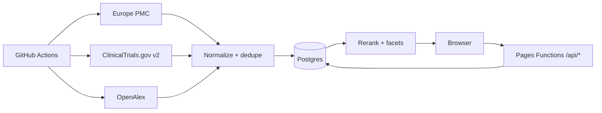

# bioXip — Blueprint

Dokumen hidup. Setiap perubahan arsitektur wajib dicatat di sini.

## 1. Vision & positioning

- Target: peneliti, mahasiswa FK/kesmas/farmasi, klinisi, nakes Indonesia.
- Masalah: literatur biomedis global (~30 jt) tersembunyi di balik bahasa Inggris dan paywall; Garuda/OneSearch/Neliti hanya mengindex konten Indonesia.
- Solusi: search engine literatur internasional yang bisa dicari dengan Bahasa Indonesia, menampilkan status open-access, dan menautkan ke versi lokal Indonesia.
- Gap yang diisi: Garuda (konten Indonesia), OneSearch (katalog perpustakaan), Neliti (platform hosting konten lokal) — tidak ada yang membawa literatur dunia ke peneliti Indonesia.
- **Prinsip produk mengikat ada di `docs/principles.md`**: pasar Indonesia, mobile-first (95%), sign in Google + Apple + magic link, share-first (WhatsApp/Instagram/Threads/X), halaman share publik, pembayaran lokal, tanpa PII.

## 2. Brand

- Nama: bioXip. Ejaan konsisten `bioXip` (bukan BioZip).
- Tagline ID: "Literatur medis dunia, untuk peneliti Indonesia."
- Tagline EN: "The world's medical literature, for Indonesian researchers."
- Nama hanya di `web/js/brand.js`.

## 3. Sumber data & keputusan lisensi

| Provider | Peran | Akses |
|---|---|---|
| Europe PMC | Korpus: paper + preprint (PubMed, bioRxiv, medRxiv, PMC full-text), citasi | Bebas, delta harian |
| ClinicalTrials.gov v2 | Korpus: trial (core dulu; results fase 2) | Bebas, delta harian |
| OpenAlex | Enrichment: OA location + citation + konsep per DOI | Bebas (CC0), mingguan |
| ChEMBL / PubChem / Open Targets | Live lookup query-time + cache 24 jam (fase 3) | Bebas |
| Neliti (OAI-PMH) | Lapisan lokal: metadata konten unik Indonesia, link ke full-text | Bebas (set=unique) |

Keputusan: JANGAN bergantung pada API berbayar/tutup (Valyu pernah dipakai di proyek lama — ditinggalkan karena index tertutup, biaya per-query, dan key bocor di riwayat git). Hanya metadata+abstrak yang disimpan; full-text OA dapat diindeks sesuai lisensi artikel; tautkan, jangan re-host.

## 4. Arsitektur

- Statis-first di Cloudflare Pages CDN; edge logic di Pages Functions; Postgres terkelola di Supabase; pipeline Python hanya berjalan offline di GitHub Actions.
- 3 jalur data: (a) korpus di-harvest ke `documents`, (b) enrichment offline, (c) live lookup yang di-cache.
- Query-time = 1 pencarian di index sendiri (Postgres FTS) + <3 panggilan live.

## 5. Skema database

File `supabase/migrations/001_documents.sql` sd `004_ops.sql`.
Inti: tabel `documents` (doc_type, identity_key unik, work_group utk dedupe preprint↔published, search_vector gin) + `term_map` (jembatan query ID→EN) + tabel ops (`harvest_runs`, `provider_cursor`, `live_cache`, `search_cache`, `search_logs`, `usage_quota`). RLS: publik read aktif; tulis hanya service_role.

## 6. Harvester & ops

- `harvest_full.py` backfill bertahap per tahun; `harvest_delta.py` harian per watermark.
- Dedupe: identity_key = doi/pmid/nct; preprint & published digabung ke `work_group`.
- Observability: `harvest_runs` mencatat counts/status/log; alert bila gagal 2x berturut.

## 7. Search API & ranking

`GET /api/search` → `fn_bioxip_search`. Query ID diekspansi lewat `term_map`.
Score = 0.36 text + 0.20 recency + 0.16 kualitas sumber + 0.12 coverage + 0.10 authority + 0.06 OA.
Satu hasil per work_group (published menang). Facet: type/source/tahun/OA/desain studi/"penelitian Indonesia".

## 8. Frontend

SPA vanilla hash-route: `#/`, `#/search`, drawer detail, `#/topic/{slug}`, `#/sources`, legal. ID default.

## 9. Keamanan & kepatuhan

Secrets: SUPABASE_URL, SUPABASE_ANON_KEY (edge), SUPABASE_SERVICE_ROLE (CI only), Turnstile. Turnstile + kuota anon di `_middleware`. Atribusi sumber + halaman kebijakan wajib. Tidak ada key di frontend.

## 10. Monetisasi

Search dasar gratis permanen. Jalur: (1) langganan institusi FK/perguruan tinggi, (2) API-as-product, (3) premium perorangan murah (terjemahan, alert, export), (4) laporan B2G, (5) sponsor/donasi. Iklan tidak direkomendasikan.

## 11. Roadmap

- F1 Fondasi: repo + migrations + harvester Europe PMC + fn search + landing search. Exit: search <800 ms; run harian tercatat.
- F2 Trial & lokal: CT.gov core + facet + filter "penelitian Indonesia" + term_map 10 topik + tombol "Cek versi lokal".
- F3 Enrichment & kimia: OpenAlex OA/citasi + live ChEMBL/PubChem/OT.
- F4 Produk masal: Turnstile, kuota, legal, admin, observability.
- F5 Monetisasi & lapisan lokal (Neliti OAI-PMH set=unique).

## 12. Decision log

- 2026-09-09 — Nama dipilih: bioXip.
- 2026-09-09 — Pasar: lokal Indonesia dulu (bilingual), data internasional.
- 2026-09-09 — Tidak memakai Valyu sebagai sumber inti (index tertutup, biaya, key bocor). Sumber = API publik yang bisa direplikasi mandiri.
- 2026-09-09 — Korpus literatur via Europe PMC tunggal (cakup PubMed+bioRxiv+medRxiv+PMC); trial via CT.gov v2; enrichment OpenAlex.
- 2026-09-09 — Neliti layak di-harvest via OAI-PMH `set=unique` (lapisan lokal) — keputusan ditunda ke fase 5.
- 2026-09-09 — Stack: Cloudflare Pages + Functions + Supabase Postgres + Python (GitHub Actions). Streamlit tidak dipakai (khusus MVP lokal).
- 2026-09-09 — Repo dibuat baru `D:\bioxip` (bukan clone eclipta: riwayat lama membawa key bocor & venv Windows).
- 2026-09-09 — Supabase: BUAT PROYEK BARU `bioxip` (region Singapore). Proyek lama `eclipta.bio` (paused) TIDAK dipakai/dilanjutkan — hanya arsip; jangan dihapus sebelum dipastikan tidak dipakai produk lain.
- 2026-09-09 — Arah (belum implementasi): harvester Neliti OAI-PMH `set=unique` → simpan metadata sendiri → hasil menautkan balik ke Neliti (fase 5).
- 2026-09-09 — Monetisasi: akses data tetap free; iklan dipertimbangkan ala Neliti dengan pagar: tanpa iklan obat/klaim kesehatan, direct-sales, transparan.
- 2026-09-09 — Opsi penyimpanan: index **metadata-only** (gaya Google Scholar). `STORE_ABSTRACTS=false`; abstrak tidak disimpan permanen; user dibuka ke sumber asli. Hasil: 20.226 dokumen = ±37 MB (kapasitas free ±270 rb dokumen). Abstrak saat detail bisa diambil live + cache pendek (fitur lanjutan).
- 2026-09-09 — Runtime: Cloudflare Pages `bioxip.pages.dev` live; Supabase project `nxlcosnksgbuvtiggjpw`; backfill manual bertahap 10k/batch (2025 & 2024 terpasang). GitHub secrets masih menunggu konfirmasi email GitHub.
- 2026-09-10 — Arah USP: "dari keputusan klinis sampai keamanan obat"; dua suite (Klinis + Farmasi), satu mesin. Strategi & validasi berlapis ada di `docs/strategy.md`. Urutan: S1 Drug Card → S2 Interaction/Monitoring → S3 Jembatan klinis↔farmasi → S4 Lapisan lokal → S5 API/intelijen.
- 2026-09-10 — CI: workflow **Validate** (katalog obat, monitoring, tabel interaksi, harness UI, cek sintaks JS) dijalankan tiap push/PR. Workflow **Validate API** harian 22:00 UTC menguji kontrak produksi. Workflow `deploy.yml` **dihapus** — deploy dilakukan otomatis oleh integrasi Git Cloudflare Pages (tanpa perlu secret Cloudflare di GitHub).
- 2026-09-10 — Validasi kontrak API: 22 cek hijau di produksi (search, answer + integritas sitasi, drug card termasuk agregasi label & monitoring, interaction checker, penolakan input tak valid).
- 2026-09-10 — Model bisnis AI: prepaid kredit (bayar → saldo → pakai AI → margin). Rancangan teknis (skema ledger, alur debit/refund, kontrak endpoint, guardrail) ada di `docs/credits.md`. Prinsip: ledger append-only + idempotent top-up + grounded-only (wajib retrieval & sitasi) + tanpa data pasien.
- 2026-09-10 — Keputusan monetisasi (lihat `docs/credits.md`): top-up via **Xendit**; **DeepSeek V4.1 Flash** sebagai provider AI tunggal (dengan abstraksi provider); **percakapan disimpan untuk evaluasi** (retensi 90 hari, boleh dihapus, tanpa data pasien); pembeda gratis vs berbayar = **mode eksplisit** (segmented: `Cari bukti · gratis` vs `Tanya AI · saldo`), search-first, estimasi Rp tampil sebelum eksekusi; endpoint search/data tidak pernah menyentuh ledger.
- 2026-09-10 — Model akses FINAL: **tanpa trial**. **Sign in wajib sejak versi gratis** (search & data gratis untuk pengguna login); **AI terkunci bila saldo Rp0**. Saldo dibeli bertingkat (Rp50rb/100rb/150rb/500rb), dalam **Rp**, **tanpa kedaluwarsa**, **tanpa bonus**, markup **12×** biaya asli DeepSeek V4.1 Flash (cache hit $0,006 / miss $0,30 / output $1,20 per 1 juta token). Top-up Xendit (QRIS + VA + e-wallet). Optimasi **prompt cache** (prefix stabil) jadi pengungkit margin utama.
- 2026-09-10 — Arsitektur basis pengetahuan AI (anti-halusinasi) ada di `docs/knowledge.md`: grounded-only + abstain + verifikasi sitasi, retrieval paralel, section-aware chunking, reranker, lapisan fakta terstruktur, golden set per domain, regresi CI. **PubMed masuk dua jalur**: via Europe PMC (`SRC:MED`, sudah terpasang) + **NCBI E-utilities langsung** (MeSH presisi, Clinical Queries, cross-check kelengkapan).
- 2026-09-10 — Rencana implementasi bertahap ada di `docs/plan.md`: Sprint 1 **Auth (Google OAuth + magic link) + gating + SEO publik** → Sprint 2 PubMed E-utilities → Sprint 3 Ledger → Sprint 4 Grounded internal + golden 30 → Sprint 5 AI proxy + debit DeepSeek → Sprint 6 UI gratis vs AI → Sprint 7 Xendit → Sprint 8 kualitas retrieval & data. Review apoteker/dokter dan lapisan lokal berjalan paralel.
- 2026-09-10 — Keputusan akses: **sign in wajib sejak versi gratis** (untuk data pengguna), metode **Google OAuth + magic link email**. Konten di balik login dikompensasi dengan halaman publik untuk SEO (`/topik/*`, drug card ringkas, `/sumber`, `/harga`, `/legal`) + **preview 3 hasil**. Onboarding mengumpulkan peran/institusi/kebutuhan + consent (UU PDP).
- 2026-09-10 — Rancangan onboarding & segmentasi ada di `docs/onboarding.md`: 3 kartu (peran dua tingkat dengan **Apoteker/Farmasi** sebagai segmen utama → institusi opsional → tujuan + consent), lalu **3 template pertanyaan AI per peran** ala Consensus (contoh hasil mock bertanda "contoh" bila saldo Rp0). Termasuk tabel `profiles`, event analitik, funnel, dan aturan pemakaian data (agregat n≥10, tanpa PII di analitik, hak hapus).
- 2026-09-10 — **Prinsip produk mengikat**: `docs/principles.md`. Pasar Indonesia; **mobile-first** (95%+, PWA, target 360px, LCP <2,5 dtk); **sign in Google OAuth + magic link/OTP** (Apple Sign In dibatalkan); in-app browser & keterkiriman email wajib ditangani; **fondasi berbagi sekarang** (halaman publik + OG tags + salin tautan), **integrasi kanal share ditunda ke backlog**; loop rujukan `?ref=` + K-factor juga di backlog; pembayaran lokal; checklist rilis mobile wajib lulus.
- 2026-09-10 — Pembatalan **Apple Sign In** (hemat biaya Apple Developer Program, hindari kerumitan Service ID/key & masalah "Hide My Email"); email sama via Google & magic link harus di-*link* agar tidak jadi akun ganda; tambah **OTP 6 digit** sebagai cadangan magic link.
- 2026-09-10 — **Sprint 2 selesai**: PubMed E-utilities (`functions/_pubmed.js`: esearch/esummary, filter Clinical Queries, throttle 150ms, `tool=bioxip`+email+opsi API key) terintegrasi ke `/api/search` sebagai fan-out ketiga; dedupe DOI/PMID dengan prioritas Europe PMC > PubMed > ClinicalTrials.gov; PubMed tidak dihitung ke `total` (karena Europe PMC sudah mencakup MEDLINE) untuk mencegah hitungan dobel; badge sumber di UI. Validasi produksi: sumber `pubmed` + `europepmc` muncul, 0 duplikat pada 4 query uji. Sprint 1 dipisah menjadi **1A (fondasi publik/SEO + salin tautan, tanpa kredensial)** dan **1B (auth+gating, menunggu Google OAuth client + SMTP)**.
