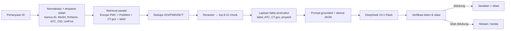

# bioXip — Arsitektur Basis Pengetahuan AI (anti-halusinasi, domain medis)

Dokumen hidup. Prinsip: **akurasi dari retrieval + verifikasi fakta, bukan dari fine-tuning**.

## 1. Prinsip
1. Grounded-only: setiap klaim wajib punya sumber `[n]`.
2. Angka (dosis, sensitivitas, eGFR) hanya dari sumber terstruktur; jika tidak ada → "tidak ditemukan di sumber".
3. Wajib **abstain** bila bukti tipis.
4. Tanpa data pasien; tolak permintaan diagnosis/peresepan.
5. Prompt disusun **cache-friendly** (prefix statis di awal; konteks & pertanyaan di akhir).

## 2. Sumber per domain (final)

| Domain | Sumber utama | Peran / catatan |
|---|---|---|
| **Kedokteran** | **PubMed/MEDLINE** — diakses **dua jalur**: (a) **Europe PMC** (`SRC:MED`, sudah terpasang) dan (b) **NCBI E-utilities langsung** | (a) agregat cepat + OA + preprint; (b) presisi MeSH, **PubMed Clinical Queries** (terapi/diagnosis/prognosis/etiologi), verifikasi kelengkapan, `efetch` terstruktur, `elink` artikel terkait |
| Kedokteran (ontologi) | **MeSH**, ICD-10/11, SNOMED (lisensi bila dipakai) | Ekspansi & presisi istilah |
| Farmasi | label **openFDA/DailyMed** (target: BPOM), **Fornas**, **RxNorm/RxClass**, ATC/DDD, Farmakope Indonesia | Dosis, kontraindikasi, interaksi, ekuivalensi |
| Kimia | **PubChem**, **ChEBI**, SMILES/InChI | Identitas & properti senyawa |
| Biologi | **UniProt**, NCBI Gene, Gene Ontology, Reactome | Protein, gen, jalur |
| Uji klinis | **ClinicalTrials.gov v2** (sudah terpasang) | Fase, status, enrollment, lokasi |
| Target obat | **Open Targets** | Target–penyakit |
| Kesehatan publik | **WHO**, **Kemenkes**, GBD | Burden, kebijakan, data Indonesia |
| Penelitian Indonesia | Garuda, OneSearch, Neliti (OAI-PMH/tautan), repositori lokal | Lapisan lokal (S4) |

### 2.1 Detail integrasi PubMed E-utilities
- Base: `https://eutils.ncbi.nlm.nih.gov/entrez/eutils/`
- Endpoint: `esearch.fcgi` (cari → PMID), `esummary.fcgi` (ringkasan), `efetch.fcgi` (abstrak, MeSH, tipe publikasi), `elink.fcgi` (artikel terkait).
- Parameter wajib: `db=pubmed`, `retmode=json`, `tool=bioxip`, `email=<admin>`, `api_key=<NCBI_API_KEY>`.
- Batas laju: **3 req/dtk tanpa key**, **10 req/dtk dengan key** → gunakan key + queue.
- **Clinical Queries**: terapkan filter kategori (therapy/diagnosis/prognosis/etiology) sebagai query preset atau parameter `filter` bila tersedia.
- **Cross-check**: bandingkan `hitCount` Europe PMC (`SRC:MED`) vs PubMed `esearch` untuk strategi yang sama; selisih besar → periksa.

## 3. Pipeline retrieval

- **Section-aware chunking**: potong per bagian (dosis, kontraindikasi, interaksi, hasil, sensitivitas) — bukan abstrak utuh.
- **Filter**: guideline > meta-analisis > RCT > observasional > preprint; manusia; tahun; open access.
- **Hemat token**: reranker memangkas konteks; cache prompt mengurangi biaya 50× (lihat `docs/credits.md`).

## 4. Skema keluaran (JSON tervalidasi)
```json
{
  "answer": "…",
  "claims": [{ "text": "…", "citations": [1, 4] }],
  "uncertainty": "tinggi|sedang|rendah",
  "abstain": false,
  "red_flags": [],
  "sources": [{ "n": 1, "title": "…", "url": "…", "source": "pubmed" }]
}
```
Aturan prompt: temperature 0–0,3; keluaran Bahasa Indonesia; struktur jawaban singkat → bukti → keterbatasan → sitasi.

## 5. Verifikasi pasca-generate
1. Pecah jawaban menjadi klaim.
2. Setiap klaim harus didukung kalimat sumber yang ada di konteks.
3. Cek entitas & angka (nama obat/dosis/uji) vs sumber terstruktur.
4. Deteksi kontradiksi antar sumber → tampilkan sebagai perbedaan.
5. Klaim tak didukung → hapus/tandai; mayoritas tak didukung → abstain.
Target: **citation support ≥ 98%**.

## 6. Guardrail keselamatan
- Tolak (422): data pasien (NIK/MRN/telepon/tanggal lahir) dan permintaan diagnosis/peresepan.
- Red flag (nyeri dada, sesak, perdarahan, penurunan kesadaran) → arahkan ke gawat darurat.
- Disclaimer + tombol sumber di setiap jawaban; log penolakan untuk audit.

## 7. Evaluasi berkelanjutan
- **Golden set** 150–300 Q&A tervalidasi ahli: 50 kedokteran, 40 farmasi, 20 kimia, 20 biologi, 20 kesehatan publik (Indonesia + Inggris).
- **Metrik**: citation support, akurasi faktual vs gold, ketepatan abstain, recall@k retrieval, hallucination rate.
- **Dua lapis**: otomatis (claim–citation matching) + review ahli (apoteker + dokter).
- **Regresi CI**: akurasi turun → build gagal.
- **Feedback pengguna**: tombol "jawaban keliru" → antrean evaluasi.

## 8. Peran fine-tuning (bukan untuk fakta)
- Klasifikasi intent/PICO, screening studi, pemformatan Bahasa Indonesia, distilasi tugas murah ke model kecil.
- Simpan versi prompt/kamus/snapshot guideline agar jawaban reproducible.

## 9. Urutan prioritas
| Fase | Isi |
|---|---|
| K1 | Prompt grounded + JSON + abstain + verifikasi sitasi + guardrail input |
| K2 | Tambah **PubMed E-utilities** (MeSH, Clinical Queries, cross-check) di samping Europe PMC |
| K3 | Retrieval hibrida (FTS + pgvector) + section chunking + reranker |
| K4 | Lapisan fakta terstruktur (label/ATC/CT.gov) + snapshot guideline nasional |
| K5 | Golden set 150 + CI regresi + review ahli |
| K6 | Ekspansi terminologi (MeSH/RxNorm/ICD/UniProt) + kamus ID dari log |
| K7 | Fine-tune intent/PICO + distilasi |
